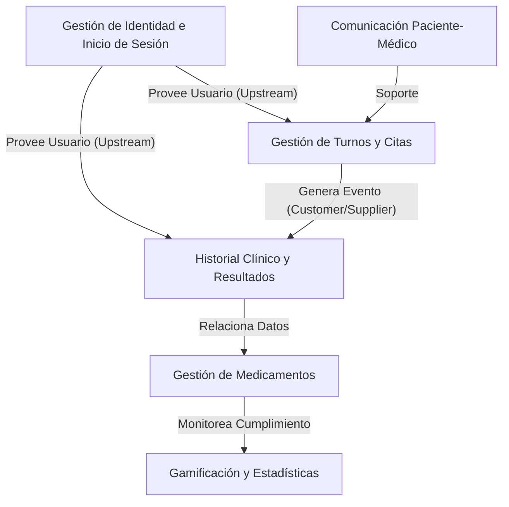

# Mapa de Contexto - Proyecto Distribuidos

Este mapa describe los límites y las relaciones entre los diferentes dominios del sistema de Gestión de Turnos.

## Relaciones Clave:
*   **IAM -> Todos:** Es un contexto núcleo (Core) que provee la identidad necesaria para el resto de los servicios.
*   **Turnos <-> Historial:** Existe una relación estrecha; cada cita finalizada alimenta el historial clínico del paciente.
*   **Medicina -> Gamificación:** El cumplimiento de las tomas de medicamentos dispara los logros y estadísticas de salud.
